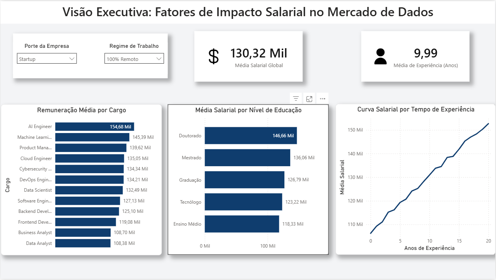

# salary-insights-eda
Análise Exploratória de Dados (EDA) sobre fatores que influenciam salários no mercado de trabalho.
# 📊 Fatores de Impacto Salarial no Mercado de Dados (EDA & Dashboard)



## 📌 Visão Geral do Projeto
Este projeto tem como objetivo analisar os principais fatores que influenciam a remuneração de profissionais da área de dados globalmente. Através de uma Análise Exploratória de Dados (EDA) e da construção de um Dashboard Executivo interativo, investigamos como variáveis como **Cargo**, **Tempo de Experiência**, **Nível de Formação Acadêmica**, **Porte da Empresa** e **Regime de Trabalho** impactam a média salarial do setor.

---

## 🎯 Objetivos e Perguntas de Negócio
O painel foi desenvolvido para responder às seguintes questões críticas de mercado:
1. Quais são os cargos com as maiores médias salariais no setor de tecnologia e dados?
2. Qual é o comportamento da curva salarial à medida que os anos de experiência aumentam?
3. Qual é o peso real do nível de estudo (Ensino Médio, Tecnólogo, Graduação, Mestrado, Doutorado) na valorização financeira do profissional?
4. Como o porte da empresa (Startup, Pequena, Média, Grande, Enterprise) afeta a remuneração?
5. Existe uma valorização salarial para modelos de trabalho específicos (100% Remoto, Presencial ou Híbrido)?

---

## 🛠️ Tecnologias e Ferramentas Utilizadas
* **Python (Pandas & NumPy):** Limpeza de dados, tratamento de valores nulos e validação de tipos.
* **Power Query (M):** Transformação e padronização de dados na camada semântica (tradução de termos e tipagem).
* **Power BI:** Modelagem, cálculos de agregação (médias globais) e visualização de dados com foco em UI/UX (Novo Cartão de KPI com ícones contextuais flutuantes, controles suspensos minimalistas, padronização de escalas e paleta executiva).

---

## 📈 Principais Insights Extraídos
* **Liderança Técnica em Alta:** Cargos de engenharia avançada como **AI Engineer** ($154,68 Mil) e **Machine Learning Engineer** ($145,39 Mil) lideram o topo da remuneração global, superando cargos de gestão e análise tradicional.
* **O Prêmio Acadêmico:** Existe uma clara correlação positiva entre o avanço acadêmico e o teto salarial. Profissionais com **Doutorado** ($146,66 Mil) e **Mestrado** ($136,06 Mil) apresentam um salto financeiro expressivo em comparação com a Graduação padrão.
* **Previsibilidade de Carreira:** A curva salarial por anos de experiência demonstra um crescimento constante e quase linear, indicando que o mercado recompensa continuamente a bagagem e a senioridade técnica acumulada.
* **O Fenômeno das Startups Remotas:** Ao filtrar dinamicamente o painel por empresas de modelo **Startup** e regime **100% Remoto**, nota-se uma forte competitividade salarial para atrair talentos altamente versáteis, compensando a ausência de estruturas físicas.

---

## 💻 Como Executar o Projeto
1. Faça o clone deste repositório:
   ```bash
   git clone [https://github.com/SeuUsuario/analise-salarios-dados.git](https://github.com/GuibasURL/analise-salarios-dados.git)
